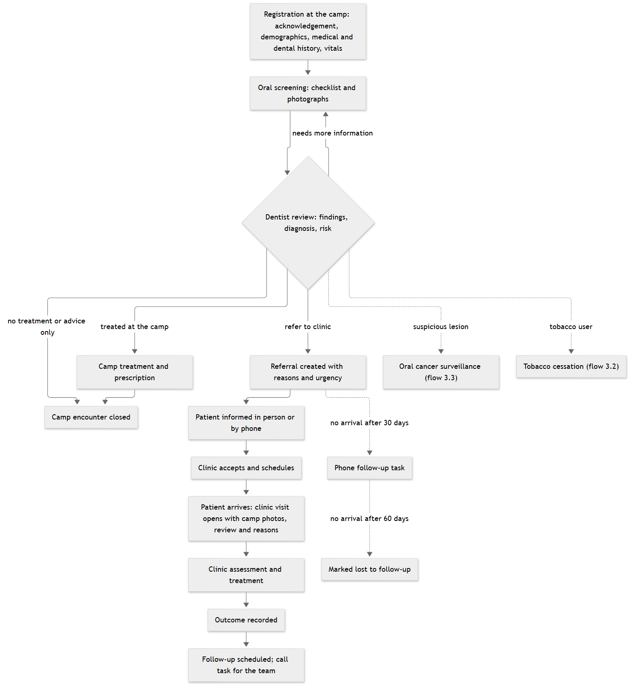
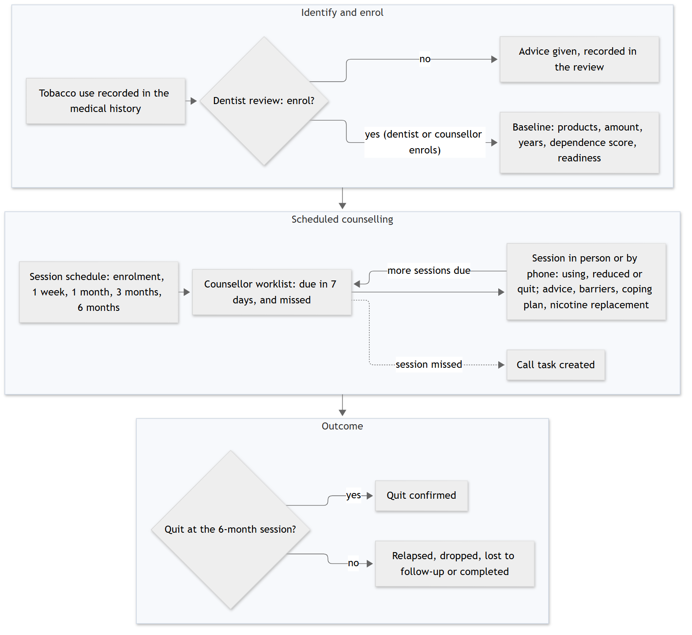
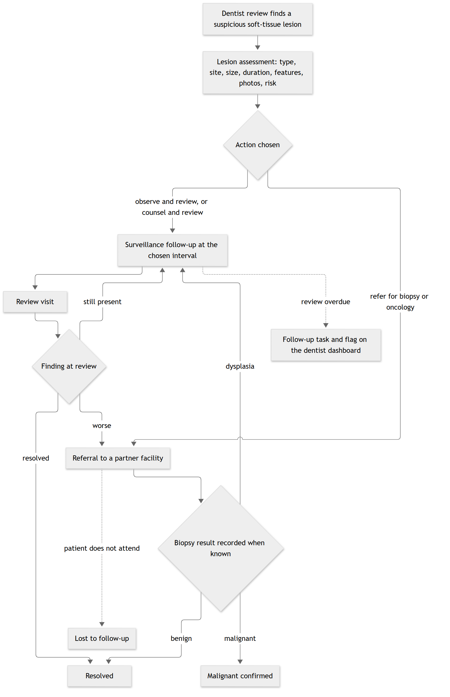
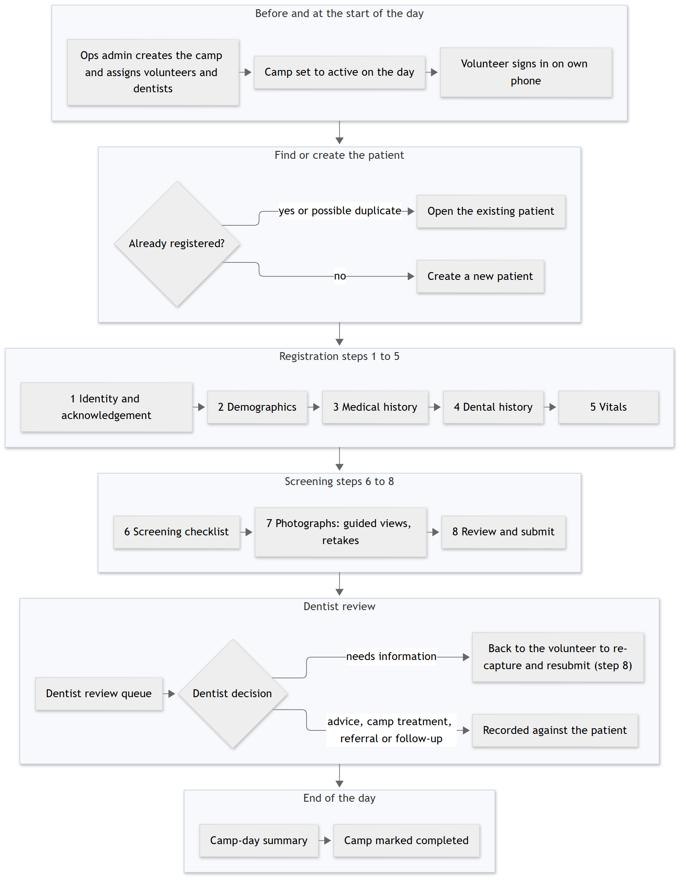
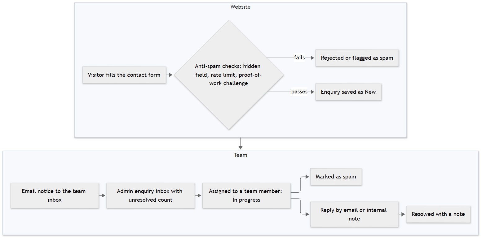
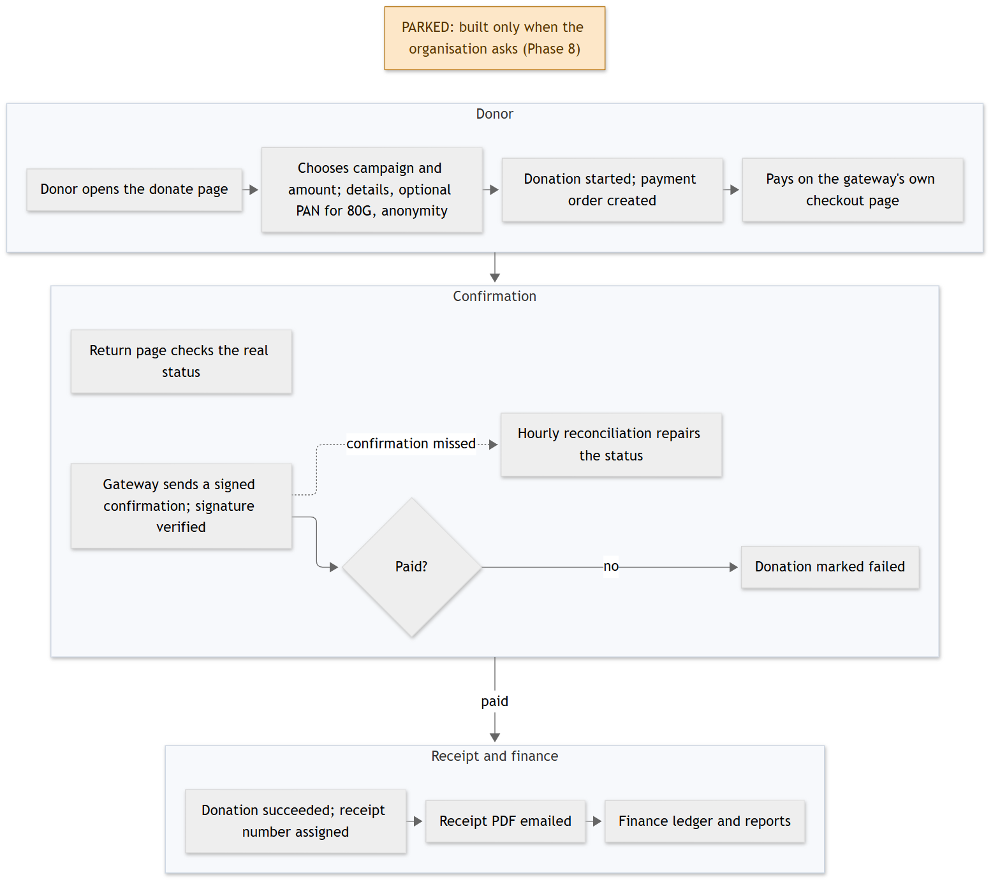
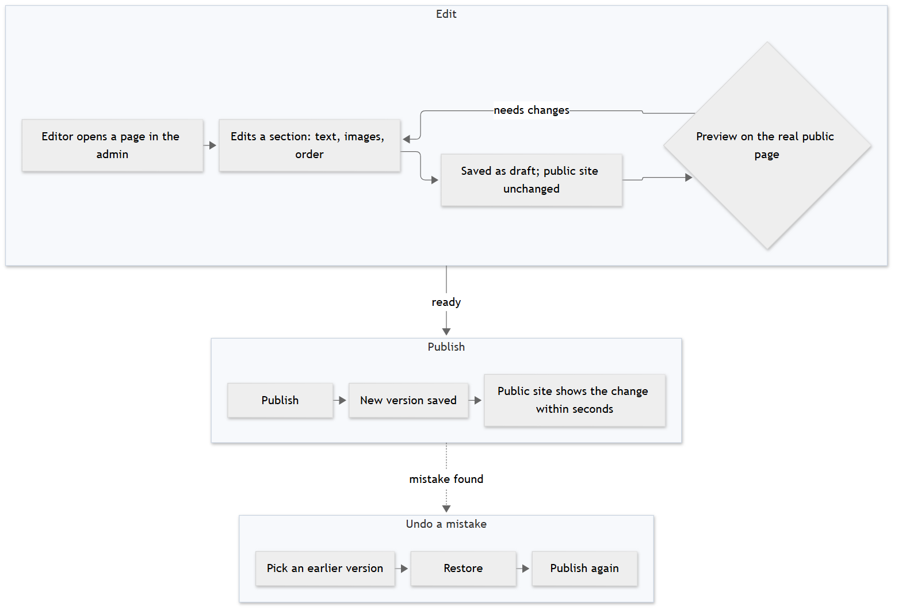
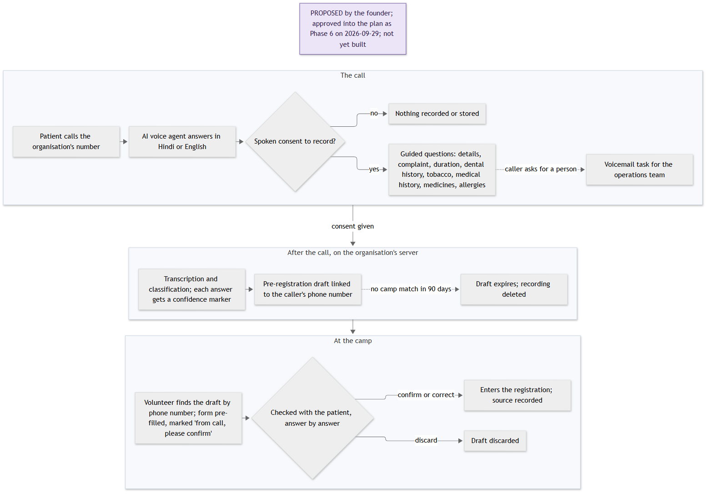
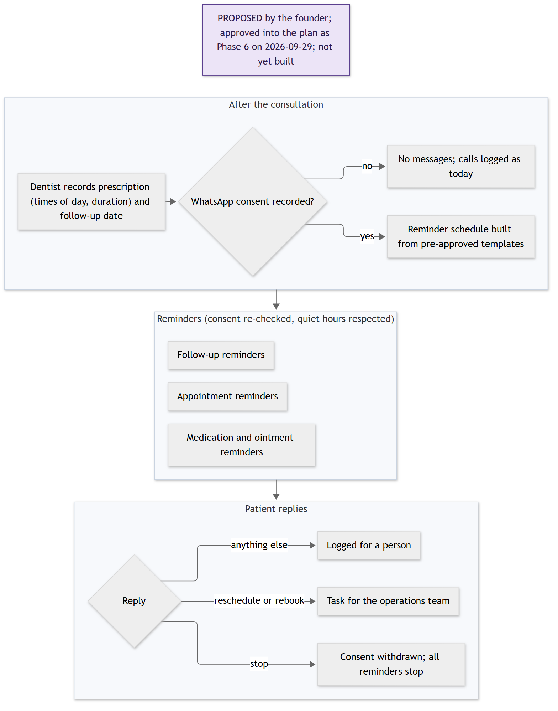

# Saathi Cares Digital Platform — Functional Requirements Specification

**Version 1.0 draft** · 29 September 2026 · Prepared for SHC Foundation / Saathi Cares

## Contents

- 1. Document control
- 2. Introduction
- 3. End-to-end flows
- 4. Functional specification
- 5. Roles and permissions
- 6. Non-functional requirements
- 7. Delivery phases
- 8. Open questions for the product owner
- 9. Glossary

## 1. Document control

| Item | Detail |
| --- | --- |
| Document | Saathi Cares Digital Platform — Functional Requirements Specification (FRS) |
| Version | 1.0 draft |
| Date | 29 September 2026 |
| Prepared for | SHC Foundation / Saathi Cares |
| Prepared by | Abhinav Goyal (developer), with AI assistance |
| Based on | PLAN.md, the approved architecture and delivery plan, revision 5 |
| Status | Draft for review by the product owner |

### 1.1 Purpose

This document describes what the Saathi Cares platform will do, module by module, in plain language. It is written so that the product owner and the people they share it with can check that the platform matches how the organisation works, and can point out what is missing or wrong before it is built.

### 1.2 Audience

- The product owner and the founder of Saathi Cares.
- Dentists, camp coordinators and volunteers who will use the platform.
- Anyone who takes over the platform later and needs to know what it is meant to do.

### 1.3 How to read this document

- Chapter 2 introduces the organisation, the problem, the users, the scope and the technology.
- Chapter 3 shows the main flows as diagrams. Read these first if you want the big picture.
- Chapter 4 is the detailed specification. Each module has a purpose, the roles that use it, its sub-modules, and a table of features.
- Chapters 5 to 9 cover who can do what, quality expectations, delivery phases, open questions and a glossary.

### 1.4 Relationship to PLAN.md

This FRS describes **what** the platform does. PLAN.md describes **how** it is built: the data model, security, infrastructure and engineering rules. Where the two disagree, PLAN.md is the approved plan and this document must be corrected. Features marked "Proposed — not in the approved plan yet" are not in PLAN.md; they need the product owner's decision before they can be planned. The patient engagement features were proposed by the founder and have since been approved into PLAN.md as Phase 6; they carry their own status (see 1.6).

### 1.5 Where the platform is today

The platform is in **Phase 0 (foundation)**. The only user-facing part that exists today is the public website pages, ported as fixed content to a staging server; the current no-code website remains the live site. Nothing else in this document exists yet: no logins, no patient records, no camp tools. Every feature below is either planned for a named phase or proposed.

### 1.6 Status legend

| Status | Meaning |
| --- | --- |
| In plan (Phase N) | Approved in PLAN.md and scheduled for that delivery phase. Phases 2 and 3 are split into two drops each (2a, 2b, 3a, 3b). Not built yet unless Phase 0. |
| Proposed — not in the approved plan yet | Asked for by the product owner or founder but not yet in the approved plan. Needs a decision, then a place in a phase. |
| Proposed — approved into the plan as Phase 6 on 2026-09-29, not yet built | Asked for by the founder and approved into PLAN.md revision 5 as Phase 6 (patient engagement: AI intake call and WhatsApp reminders). Planned, not built. |
| Parked | In the plan (Phase 8, donations) but only built when the organisation asks for it. |

## 2. Introduction

### 2.1 The organisation

Saathi Cares (SHC Foundation) is a non-profit that runs free dental camps in villages and tier-2 and tier-3 cities. Patients who need more care are referred to Saathi or partner clinics. The organisation also runs oral cancer screening, tobacco cessation counselling and community education, and raises funds from the public.

### 2.2 The problem

- Patient information is on paper and in scattered forms and spreadsheets. There is no single record per patient.
- At camps, volunteers write the same details again and again. Photographs, if taken, are not linked to the patient.
- When a patient is referred to a clinic, the clinic does not see what was found at the camp. Referrals are lost and nobody knows whether the patient arrived or was treated.
- Patients with suspicious mouth lesions or tobacco habits are not followed up in a structured way.
- The founder cannot see how many people were screened, referred, treated or helped to quit tobacco.
- The public website is a no-code build that staff cannot fully edit themselves.

### 2.3 The goal

One self-hosted, open-source web platform that is at the same time the public website, the operational system for camps and clinics (a dental patient record built for camp work), and the admin area where each staff member sees what their role allows.

Success looks like this: a volunteer registers a patient with photos on their phone at a camp; a dentist reviews it the same day and refers; the clinic dentist opens the same record, photos included, a week later; the founder sees the camp-to-clinic numbers on a dashboard; and no data ever lives only in one person's phone or browser.

### 2.4 Users

| User | Who they are | What they mainly do |
| --- | --- | --- |
| Public visitor | Anyone on the internet | Reads the website, sends an enquiry through the contact form |
| Donor | A member of the public who gives money | Donates online and receives a receipt (parked, Phase 8) |
| Volunteer | Field staff at camps, on their own phones | Registers patients, records histories and vitals, takes mouth photographs |
| Dentist | Camp or clinic dentist | Reviews patients, records findings and decisions, treats, prescribes, refers, assesses lesions |
| Counsellor | Delivers tobacco cessation sessions; the dentist holds this role by default | Runs the counselling schedule and records quit status |
| Ops admin | Camp coordinator or office staff | Sets up camps and clinics, manages referrals and follow-ups, edits the website, handles enquiries |
| Finance | Finance staff | Donations ledger, receipts, reconciliation, statutory exports (Phase 8) |
| Patient | A person seen at a camp or clinic | From Phase 6: calls the intake line before the camp and receives WhatsApp reminders after a consultation, with consent |
| Super admin | The developer and, later, a named senior staff member | Manages users, roles and settings; full access, always audited |

### 2.5 Scope of version 1

- Public website with a content management system and a contact form.
- Staff accounts with roles, two-factor sign-in for privileged roles, and an audit trail.
- Camp and clinic set-up, patient registration, oral screening with photographs, dentist review, treatment and prescriptions.
- Referral to clinics with full continuity, outcomes and follow-ups, and a log of calls and in-person notices to patients.
- Oral cancer surveillance and tobacco cessation programmes.
- AI-assisted screening of mouth photographs, as help for the dentist only.
- Dashboards and reports for each role, with controlled exports.
- Online donations and finance tools are designed now but parked until the organisation asks (Phase 8).
- Patient engagement: an AI intake call before the camp and WhatsApp reminders after the consultation (Phase 6, approved on 29 September 2026, see 4.19).

### 2.6 Out of scope for version 1

- Offline mode. Camps have mobile data; the app works online and keeps drafts safe during short drops.
- SMS messages to patients. Until Phase 6 adds WhatsApp reminders, only calls and in-person notices are logged.
- A full consent management system and a data retention period (one recorded acknowledgement per patient is used instead).
- Billing, inventory and staff rostering at clinics (treatment is free).
- Links to hospital systems. Biopsy results from partner facilities are entered by hand.
- Storing Aadhaar numbers. They are never stored.
- Languages other than English in the interface.
- Import of old records (they are on paper only). Selected paper records can be typed in through the normal form.
- Multiple organisations on one platform.

### 2.7 Technology stack

All software is open source and runs on one rented server, except where a free or unavoidable outside service is named. Versions and tuning are in PLAN.md.

| Area | Choice | Purpose in one line |
| --- | --- | --- |
| Runtime | Node.js | Runs the application on the server |
| Framework | Next.js | One application for the public site, the admin area and the API |
| Language | TypeScript (strict) | Catches mistakes before the code runs |
| User interface | React, Tailwind CSS, shadcn/ui, lucide icons | Screens and the existing Saathi Cares look and feel |
| Forms and validation | react-hook-form and zod | The same rules check a form on the phone and on the server |
| Data access | Drizzle ORM | Reads and writes the database in readable, reviewable form |
| Database | PostgreSQL | Stores all records: patients, camps, content, audit, jobs |
| Background jobs | pg-boss | Runs emails, reminders and exports in the background, inside the database |
| File storage | Encrypted disk on the server | Keeps photographs and documents; can move to cloud storage later |
| Image processing | sharp | Shrinks photos and removes hidden location data from them |
| AI inference | Separate Python service (FastAPI, ONNX Runtime) | Reads mouth photographs and returns a preliminary result (Phase 5) |
| Sign-in | Better Auth | Passwords, sessions, invitations and two-factor codes |
| Email | Nodemailer over a Gmail account | Sends invitations, password resets and staff notices |
| Web server | Nginx | Secure connection, protection limits and fast delivery of pages |
| Packaging | Docker and Docker Compose | Runs the same set-up in development, testing and production |
| Logs | pino | Records what happened, without patient details |
| Health checks and alerts | A scheduled check script posting to Slack | Tells the team within minutes when something is wrong |
| Uptime | Free hosted uptime monitor | Watches the site from outside the server |
| Backups | pg_dump and restic | Encrypted backups, copied off the server and tested monthly |
| Build and deploy | GitHub Actions | Tests every change and deploys approved versions |
| Testing | Vitest and Playwright | Automatic checks of the code and of real screens on phone sizes |
| Payments | Razorpay or another gateway (parked) | Takes online donations (Phase 8, gateway to be chosen) |
| Edge | Cloudflare free tier | Speeds up the site and blocks attacks |
| Telephony (Phase 6) | An Indian phone number, on a line into self-hosted FreeSWITCH or Asterisk, or a cloud telephony service | Receives intake calls; the line itself is an outside carrier service |
| Speech and language (Phase 6) | Self-hosted Whisper-class speech-to-text, a small self-hosted language model, self-hosted text-to-speech | Understands the caller and fills the draft fields, keeping recordings on the organisation's server |
| WhatsApp (Phase 6) | WhatsApp Business Platform through a Meta business solution provider | Sends template reminders and receives replies |

## 3. End-to-end flows

These diagrams show how work moves through the platform. Solid arrows are the normal path; dotted arrows are exceptions or side paths. Flows 3.8 and 3.9 belong to the Patient engagement module, proposed by the founder and approved into the plan as Phase 6 on 29 September 2026; they are not built.

### 3.1 Patient care pathway

One patient record follows the person from camp registration to outcome and follow-up. The dentist review is the only clinical decision point; everything before it is preparation, everything after it follows from it.

*Figure 1. Patient care pathway, camp to clinic to follow-up*

### 3.2 Tobacco cessation pathway

Tobacco use captured in the medical history can lead to enrolment in the cessation programme. Sessions follow a default schedule that the organisation can change.

*Figure 2. Tobacco cessation pathway*

### 3.3 Oral cancer surveillance pathway

Every suspicious lesion becomes a tracked assessment that stays on the dentist's dashboard until it is resolved, confirmed or lost to follow-up, so no lesion silently disappears.

*Figure 3. Oral cancer surveillance pathway*

### 3.4 Camp day operational flow

*Figure 4. Camp day, from set-up to camp completed*

### 3.5 Enquiry (contact form) flow

*Figure 5. Enquiry flow*

### 3.6 Donation flow (parked)

This flow is designed but parked: it is built in Phase 8 only when the organisation asks for online donations and has chosen a payment gateway.

*Figure 6. Donation flow (parked)*

### 3.7 Content publishing flow

*Figure 7. Publishing website content*

### 3.8 AI intake call flow (proposed)

*Figure 8. AI intake call (proposed)*

### 3.9 WhatsApp reminders flow (proposed)

*Figure 9. WhatsApp reminders and appointments (proposed)*

## 4. Functional specification

Each module below lists its purpose, the roles that use it, its sub-modules and a table of features. "Actor" is the role that performs the action; "System" means the platform does it on its own.

### 4.1 Public website and content management

**Purpose.** The public website tells people what Saathi Cares does and lets them get in touch. The content management system (CMS) lets staff change every part of the site without a developer, with drafts, preview, publishing and undo.

**Users.** Public visitor (reads); ops admin and super admin (edit and publish).

#### 4.1.1 Public pages

| Feature | Description | Actor | Status |
| --- | --- | --- | --- |
| Public pages with fixed content | Home, about, programmes, contact and other existing pages rebuilt on the new platform with the current design. Content is fixed in this step and the pages stay on the staging server; the no-code site stays live. | Public visitor | In plan (Phase 0) |
| Pages driven by CMS content | Public pages read only published content from the CMS, so an edit in the admin shows on the site. | Public visitor | In plan (Phase 4) |
| Search engine support | Page titles and descriptions from CMS fields, a sitemap and robots file, and permanent redirects from the old site's addresses. | System | In plan (Phase 4) |
| Resilient published pages | Pages that were already shown stay available from cache if the database is briefly down. | System | In plan (Phase 4) |
| Public cut-over | The domain moves to the new site after a week of running both; the no-code site is then switched off. | Super admin | In plan (Phase 4) |

#### 4.1.2 Pages and sections

| Feature | Description | Actor | Status |
| --- | --- | --- | --- |
| Page list | See all website pages with their status (draft, published, archived). | Ops admin | In plan (Phase 4) |
| Section editor | Each page is built from sections: hero, about, problem, programmes, impact numbers, team with photos, call to action, rich text, gallery, contact information. Each section type has its own form with checks on required fields. | Ops admin | In plan (Phase 4) |
| Reorder sections | Change the order of sections on a page. | Ops admin | In plan (Phase 4) |
| Import current content | The content now hard-coded in the pages is loaded into the CMS once, so editing starts from what is live today. | Super admin | In plan (Phase 4) |

#### 4.1.3 Media library

| Feature | Description | Actor | Status |
| --- | --- | --- | --- |
| Upload images | Upload website images; the system creates smaller sizes automatically and removes hidden location data. | Ops admin | In plan (Phase 4) |
| Alt text | Add a text description to each image for screen readers and search engines. | Ops admin | In plan (Phase 4) |
| Usage tracking and delete guard | See where an image is used; an image in use cannot be deleted. | Ops admin | In plan (Phase 4) |
| Image picker | Choose an image from the library inside any section form. | Ops admin | In plan (Phase 4) |

#### 4.1.4 Draft, preview, publish and rollback

| Feature | Description | Actor | Status |
| --- | --- | --- | --- |
| Drafts | Edits are saved as drafts and do not change the public site. | Ops admin | In plan (Phase 4) |
| Preview | See the draft on the real public page before anyone else does. | Ops admin | In plan (Phase 4) |
| Publish | Publish a section; the public site shows the change within seconds, without a new deploy. | Ops admin | In plan (Phase 4) |
| Version list and restore | Every publish keeps a version. Pick an earlier version and restore it in one click. | Ops admin | In plan (Phase 4) |
| Who changed what | Each change shows who made it and when, from the audit trail. | Ops admin | In plan (Phase 4) |

#### 4.1.5 Site settings and navigation

| Feature | Description | Actor | Status |
| --- | --- | --- | --- |
| Site settings | Organisation name, address, phone numbers, social links and a donation on/off switch, edited in one form. | Ops admin | In plan (Phase 4) |
| Header and footer navigation | Edit the menu links in the header and footer. | Ops admin | In plan (Phase 4) |

### 4.2 Enquiries

**Purpose.** Turns the website contact form into a tracked inbox so that no message is lost and every enquiry has an owner and an outcome.

**Users.** Public visitor (sends); ops admin and super admin (handle).

#### 4.2.1 Contact form

| Feature | Description | Actor | Status |
| --- | --- | --- | --- |
| Contact form | Name, email, phone, subject and message. | Public visitor | In plan (Phase 4) |
| Spam protection | A hidden trap field, a limit on how often one address can send, and ALTCHA, a privacy-friendly proof-of-work challenge instead of a picture puzzle. Suspicious messages are flagged as spam. | System | In plan (Phase 4) |
| Team notice | Each new enquiry sends an email notice to the configured team inbox. | System | In plan (Phase 4) |

#### 4.2.2 Enquiry inbox

| Feature | Description | Actor | Status |
| --- | --- | --- | --- |
| Inbox with status | List of enquiries by status: new, in progress, resolved, spam. A badge shows the unresolved count. | Ops admin | In plan (Phase 4) |
| Assignment | Assign an enquiry to a team member. | Ops admin | In plan (Phase 4) |
| Reply and notes | Reply by email from the admin, or add an internal note. All replies are kept with the enquiry. | Ops admin | In plan (Phase 4) |
| Resolve | Close an enquiry with a resolution note, or mark it as spam. | Ops admin | In plan (Phase 4) |
| Search | Search enquiries by name, subject and message text. | Ops admin | In plan (Phase 4) |

### 4.3 Identity and access

**Purpose.** Makes sure only the right people get in, that each person can do only what their role allows, and that every change is recorded. There is no self-registration for staff.

**Users.** All staff sign in; super admin manages users and roles; ops admin can view users.

#### 4.3.1 Sign-in and sessions

| Feature | Description | Actor | Status |
| --- | --- | --- | --- |
| Email and password sign-in | Staff sign in with email and a strong password. Very common passwords are refused. | All staff | In plan (Phase 1) |
| Lockout after repeated failures | Too many wrong attempts slow down and then briefly lock the account; every attempt is logged. | System | In plan (Phase 1) |
| Session time-outs | Sessions end after a period of inactivity. Volunteer sessions end sooner because they use their own phones. | System | In plan (Phase 1) |
| Sign out everywhere | A user can end all their sessions on all devices; an admin can do this for any user, for example after a lost phone. | All staff / Super admin | In plan (Phase 1) |
| Password reset | A single-use, short-lived reset link by email. All old sessions end after a reset. | All staff | In plan (Phase 1) |

#### 4.3.2 Two-factor sign-in (MFA)

| Feature | Description | Actor | Status |
| --- | --- | --- | --- |
| Authenticator app codes | A six-digit code from an authenticator app, set up by scanning a QR code at first sign-in. | All staff | In plan (Phase 1) |
| Mandatory for privileged roles | Required for super admin, ops admin and finance; optional for others. | System | In plan (Phase 1) |
| Recovery codes | Eight one-time recovery codes for a lost phone. | All staff | In plan (Phase 1) |
| Reset MFA | An admin can reset a user's two-factor set-up. | Super admin | In plan (Phase 1) |

#### 4.3.3 Invitations and user management

| Feature | Description | Actor | Status |
| --- | --- | --- | --- |
| Invite a user | An admin creates a user and assigns roles; the user gets a single-use invitation link, valid for 24 hours, to set a password and two-factor sign-in. | Super admin | In plan (Phase 1) |
| Users list | Search, view, edit and disable users. A disabled user is refused on their very next request. | Super admin | In plan (Phase 1) |
| Camp and clinic assignment | Link volunteers and dentists to camps, and clinic dentists to their clinic. This decides which patients they can see. | Ops admin | In plan (Phase 2a) |

#### 4.3.4 Roles and permissions

| Feature | Description | Actor | Status |
| --- | --- | --- | --- |
| Six roles | Super admin, ops admin, dentist, counsellor, volunteer, finance. One person may hold more than one role (for example dentist and counsellor). | System | In plan (Phase 1) |
| Permission checks on the server | Every action is checked on the server, not only hidden in the menu. A user who is not allowed gets a refusal even if they find the address. | System | In plan (Phase 1) |
| Row-level scope | Dentists and volunteers see patients of their assigned camps; clinic dentists see patients referred to their clinic; counsellors see only their enrolled patients. | System | In plan (Phase 2a) |
| Roles view | See each role and its permissions. Roles can be adjusted by the super admin, except the core permissions of the six built-in roles. | Super admin | In plan (Phase 1) |
| Menus by role | Each user sees only the menus they can use. | System | In plan (Phase 1) |

#### 4.3.5 Audit trail

| Feature | Description | Actor | Status |
| --- | --- | --- | --- |
| Audit of every change | Every change records who, what, when and from where. The record cannot be edited or deleted. | System | In plan (Phase 1) |
| No patient details in the audit | For patient and clinical records, the audit stores which fields changed, not the values. | System | In plan (Phase 1) |
| Record of who viewed a patient | Every opening of a patient's clinical record is logged. When a dentist or admin opens a record outside their assigned camps or clinic, they must pick a reason (care, admin, audit, report). | System | In plan (Phase 2a) |
| Audit viewer | Search the audit trail by person, record and date. | Super admin / Ops admin | In plan (Phase 1) |

### 4.4 Patient registration

**Purpose.** Creates one record per person that follows them through every camp and clinic visit. Registration is a step-by-step form designed first for a 360-pixel phone screen, filled by a volunteer at the camp.

**Users.** Volunteer (registers); dentist and ops admin (edit, merge); super admin.

#### 4.4.1 Identity and acknowledgement

| Feature | Description | Actor | Status |
| --- | --- | --- | --- |
| Search before create | Search by patient code, phone number or name (tolerant of spelling differences) before creating a new patient. | Volunteer | In plan (Phase 2a) |
| Patient code | Each patient gets a unique code such as SC-P-000123. | System | In plan (Phase 2a) |
| Recorded acknowledgement | One tap confirming the patient (or guardian) was told what is being recorded, including photographs, and agreed. Registration cannot be submitted without it. | Volunteer | In plan (Phase 2a) |
| Optional ABHA number | The national health ID can be recorded if the patient offers it; it is stored encrypted. Aadhaar is never stored. | Volunteer | In plan (Phase 2a) |

#### 4.4.2 Demographics

| Feature | Description | Actor | Status |
| --- | --- | --- | --- |
| Personal details | Name, gender, date of birth or age, phone and alternative phone, guardian name and relation, address, village or area, district, state, PIN code. | Volunteer | In plan (Phase 2a) |
| Preferences | Preferred language and preferred way to be contacted. | Volunteer | In plan (Phase 2a) |

#### 4.4.3 Medical history

| Feature | Description | Actor | Status |
| --- | --- | --- | --- |
| Conditions checklist | Diabetes, hypertension, heart disease, bleeding disorder, epilepsy, asthma, thyroid, TB, HIV, kidney disease, pregnancy, none, other. | Volunteer | In plan (Phase 2a) |
| Allergies and medicines | Allergies with reaction; current medicines with what they are for. | Volunteer | In plan (Phase 2a) |
| Habits | Smoked tobacco, chewed tobacco, areca nut or gutkha, alcohol: never, past or current, with notes on frequency. This feeds the tobacco cessation programme. | Volunteer | In plan (Phase 2a) |
| Hospital stays and surgeries | Free text, with a reminder not to enter other people's names. | Volunteer | In plan (Phase 2a) |
| History per visit | The history is saved for each visit, so it shows what was true at that time; the latest is shown on the patient's timeline. | System | In plan (Phase 2a) |

#### 4.4.4 Dental history

| Feature | Description | Actor | Status |
| --- | --- | --- | --- |
| Dental background | Last dental visit, previous treatments (filling, extraction, root canal, scaling, denture, braces), chief dental complaint. | Volunteer | In plan (Phase 2a) |
| Pain | Present or not, location, duration, severity 0–10, and what makes it worse. | Volunteer | In plan (Phase 2a) |
| Symptoms | Bleeding gums, sensitivity, mobile teeth, bad breath, ulcer, swelling, dry mouth, difficulty chewing. | Volunteer | In plan (Phase 2a) |
| Hygiene and diet | Brushing frequency and method (including finger, powder or datun), fluoride paste, sugar frequency. | Volunteer | In plan (Phase 2a) |

#### 4.4.5 Vitals

| Feature | Description | Actor | Status |
| --- | --- | --- | --- |
| Vitals with range checks | Blood pressure, temperature, pulse, oxygen saturation, weight, height, random blood sugar. Values outside a sensible range are questioned before saving. | Volunteer | In plan (Phase 2a) |

#### 4.4.6 Duplicate detection and merge

| Feature | Description | Actor | Status |
| --- | --- | --- | --- |
| Duplicate check at registration | On create, name similarity, phone, village and age band are compared. The volunteer sees "existing", "possible duplicate" or "new". | System | In plan (Phase 2a) |
| Override | Creating a new patient despite a strong match needs a special permission and is recorded for review. | Dentist / Ops admin | In plan (Phase 2a) |
| Nightly duplicate scan | Each night recent registrations are compared and possible duplicates listed. | System | In plan (Phase 2a) |
| Duplicate review and merge | A review screen to merge two records into one or mark them "not a duplicate". The merge keeps a trail. | Dentist / Ops admin | In plan (Phase 2a) |

#### 4.4.7 Back-entry of paper records

| Feature | Description | Actor | Status |
| --- | --- | --- | --- |
| Enter selected paper records | If the organisation wants history in the system, ops admins can type selected paper records in through the same registration form. There is no bulk import. | Ops admin | In plan (Phase 2a) |

#### 4.4.8 Form builder (proposed)

The product owner asked that an admin can add a field to a form and have it appear in the form and in the stored record, without a developer. The approved plan uses fixed, checked lists for histories, and adding a field is a developer change (a task the hand-over documents must teach). A form builder would change that and needs a decision.

| Feature | Description | Actor | Status |
| --- | --- | --- | --- |
| Add a field | An admin adds a field to a registration step: label, type (text, number, yes/no, single choice, multiple choice, date), choices, whether it is required, and help text. | Super admin / Ops admin | Proposed — not in the approved plan yet |
| Field appears in the form | The new field shows in the registration form on the next form open, on phones and laptops. | System | Proposed — not in the approved plan yet |
| Value stored with the record | The answer is saved with the patient's visit record, exactly like built-in fields, and shown on the timeline and in the dentist review. | System | Proposed — not in the approved plan yet |
| Form versions | Each change to a form creates a new version, so older records keep the meaning they had when they were filled. | System | Proposed — not in the approved plan yet |
| Retire, never delete | A field can be retired from the form; past answers are kept. | Super admin / Ops admin | Proposed — not in the approved plan yet |
| Use in reports and exports | Added fields can be included in exports and simple counts. | Ops admin | Proposed — not in the approved plan yet |

### 4.5 Camp management

**Purpose.** Plans and runs camps: where and when they happen, who works at them, and what happened on the day. Clinics are managed here too, because camps refer to them.

**Users.** Ops admin and super admin (manage); dentists and volunteers (see their assigned camps).

#### 4.5.1 Camps

| Feature | Description | Actor | Status |
| --- | --- | --- | --- |
| Create and edit a camp | Code (for example SC-CAMP-2026-014), name, date and times, venue, village or area, district, state, map location, type (screening, treatment, awareness), partner organisation, target number of patients, notes. | Ops admin | In plan (Phase 2a) |
| Camp status | Planned, active, completed or cancelled. | Ops admin | In plan (Phase 2a) |
| Staffing | Assign volunteers and dentists to the camp with their role at the camp. | Ops admin | In plan (Phase 2a) |
| My camps | Volunteers and dentists see only the camps they are assigned to. | Volunteer / Dentist | In plan (Phase 2a) |
| Camp-day summary | Counts for the day: registered, submitted, reviewed, needing information, referred. | Ops admin / Dentist | In plan (Phase 2a) |
| Reassign or close a record | An ops admin can reassign a patient visit or close it, with a reason. | Ops admin | In plan (Phase 2a) |

#### 4.5.2 Clinics

| Feature | Description | Actor | Status |
| --- | --- | --- | --- |
| Clinics | Add and edit clinics: code, name, address, district, phone, contact person, whether it is a Saathi clinic, active or not. | Ops admin | In plan (Phase 2a) |
| Clinic staff | Link clinic dentists to their clinic. | Ops admin | In plan (Phase 2a) |
| Clinic day schedule | The day's list for a clinic, built from scheduled referrals and follow-ups due. | Ops admin / Dentist | In plan (Phase 3a) |

### 4.6 Oral screening capture

**Purpose.** Captures what the volunteer sees in the mouth and the photographs the dentist will review. It is preparation for the dentist, never a diagnosis on its own.

**Users.** Volunteer (captures); dentist (reviews, may ask for retakes).

#### 4.6.1 Screening checklist

| Feature | Description | Actor | Status |
| --- | --- | --- | --- |
| Checklist | Visible decay, plaque and calculus (none, mild, heavy), bleeding gums, ulcer or lesion with location, missing teeth, mobile teeth, stains, bite problems, swelling, notes. | Volunteer | In plan (Phase 2a) |
| Checklist as a preliminary result | The checklist is recorded as the volunteer's preliminary read, which the dentist sees next to the photos. | System | In plan (Phase 2b) |

#### 4.6.2 Photographs with guided views

| Feature | Description | Actor | Status |
| --- | --- | --- | --- |
| Guided capture | The phone camera is used with suggested views: front, upper arch, lower arch, left side, right side, lesion close-up, other. The views are guidance, not a fixed set; the dentist will confirm the list. | Volunteer | In plan (Phase 2a) |
| At least one photo, no maximum | At least one photo is needed to submit; the dentist may ask for as many close-ups as the case needs. | System | In plan (Phase 2a) |
| Upload with progress | Photos are resized and compressed on the phone, then uploaded with a progress bar. | Volunteer | In plan (Phase 2a) |
| Mouth only | Photos are of the mouth only; there is no "face" view. Hidden location data is removed on upload. | System | In plan (Phase 2a) |
| Private storage | Photos are stored privately, shown only through short-lived links, and never placed on the public website or its cache. | System | In plan (Phase 2a) |

#### 4.6.3 Retakes and quality flags

| Feature | Description | Actor | Status |
| --- | --- | --- | --- |
| Quality flags | Each photo can be marked OK, blurry, poor light or retake requested. | Volunteer / Dentist | In plan (Phase 2a) |
| Retake | A retake replaces a poor photo while keeping the link to the original. | Volunteer | In plan (Phase 2a) |

#### 4.6.4 Submit and hand-over

| Feature | Description | Actor | Status |
| --- | --- | --- | --- |
| Review and submit | The last step shows everything entered; submitting sends the patient to the dentist review queue. | Volunteer | In plan (Phase 2a) |
| Visit stages | Each camp visit moves through draft, submitted, under dentist review, needs information, reviewed and closed. Each move records who and when. | System | In plan (Phase 2a) |

### 4.7 Doctor / dentist module

**Purpose.** Gives the dentist everything needed to make the clinical decision in one screen, and records that decision as the only authoritative clinical record. The dentist is on the ground at camps and reviews the same day.

**Users.** Dentist (camp and clinic); super admin.

#### 4.7.1 Review queue

| Feature | Description | Actor | Status |
| --- | --- | --- | --- |
| Review queue | Patients waiting for review, filtered by camp, screening risk and how long they have waited. | Dentist | In plan (Phase 2b) |
| Dentist dashboard | Own queue, open lesion assessments that still need action, and own activity. | Dentist | In plan (Phase 3b) |

#### 4.7.2 Review screen and image gallery

| Feature | Description | Actor | Status |
| --- | --- | --- | --- |
| Image gallery | All photos with zoom and view labels. | Dentist | In plan (Phase 2b) |
| Side-by-side context | Screening checklist, medical and dental history and vitals next to the photos. | Dentist | In plan (Phase 2b) |
| Patient timeline | All visits, screenings and reviews for the patient in one scroll. | Dentist | In plan (Phase 2b) |
| Preliminary AI result | When a validated model is in use, its preliminary result is shown here, clearly labelled (see 4.14). | Dentist | In plan (Phase 5) |

#### 4.7.3 Findings on a tooth chart

| Feature | Description | Actor | Status |
| --- | --- | --- | --- |
| Tooth chart | Record findings per tooth using the standard two-digit tooth numbering (FDI), with surface, severity and notes. | Dentist | In plan (Phase 2b) |
| Soft tissue and gums | Soft tissue findings and gum status (healthy, gingivitis, mild, moderate or severe periodontitis). | Dentist | In plan (Phase 2b) |

#### 4.7.4 Diagnosis, risk and decision

| Feature | Description | Actor | Status |
| --- | --- | --- | --- |
| Diagnosis | Diagnosis summary, plus coded diagnoses from the dental section of the ICD-10 list, with the teeth involved. | Dentist | In plan (Phase 2b) |
| Risk level | Low, moderate, high or urgent. | Dentist | In plan (Phase 2b) |
| Decision | No treatment needed, advice only, treated at the camp, refer to clinic, refer to an outside facility, or follow-up only; with the reason and the advice given. | Dentist | In plan (Phase 2b) |
| Re-review | A dentist can review again; the new review replaces the old one and both are kept. | Dentist | In plan (Phase 2b) |
| Enrol in tobacco cessation | From the review, enrol the patient in the cessation programme (see 4.12). | Dentist | In plan (Phase 3b) |
| Record a suspicious lesion | From the review, open an oral lesion assessment (see 4.13). | Dentist | In plan (Phase 3b) |

#### 4.7.5 Needs-information loop

| Feature | Description | Actor | Status |
| --- | --- | --- | --- |
| Ask for more information | Send the record back to the volunteer with a note, for example a blurry photo or a missing history. The volunteer completes it and resubmits. | Dentist | In plan (Phase 2b) |

#### 4.7.6 Treatments

| Feature | Description | Actor | Status |
| --- | --- | --- | --- |
| Record treatment | Procedure (scaling, filling, extraction, fluoride, sealant, root canal, denture, hygiene instruction, other), teeth, materials, notes; at camp or clinic. | Dentist | In plan (Phase 2b) |

#### 4.7.7 Prescriptions and print sheet

| Feature | Description | Actor | Status |
| --- | --- | --- | --- |
| Structured prescription | Medicines with strength, dose, frequency, number of days and instructions; general and follow-up instructions. | Dentist | In plan (Phase 2b) |
| Print sheet | An A5 prescription sheet to print and hand to the patient. English; Hindi labels only if the organisation asks. | Dentist | In plan (Phase 2b) |
| Delivery record | Records how the prescription reached the patient: printed, or none. | Dentist | In plan (Phase 2b) |

#### 4.7.8 Referrals

| Feature | Description | Actor | Status |
| --- | --- | --- | --- |
| Refer from the review | Create a referral from a completed review, with reasons, details, recommended procedures and urgency (see 4.9). | Dentist | In plan (Phase 3a) |

#### 4.7.9 Consultation scribe (proposed)

The product owner asked for a scribe: the dentist starts the consultation, the conversation is recorded, and the platform fills the structured fields for the dentist to confirm.

| Feature | Description | Actor | Status |
| --- | --- | --- | --- |
| Start consultation | The dentist presses "start consultation" on the review screen for a patient. | Dentist | Proposed — not in the approved plan yet |
| Consent check | Recording starts only after the patient's consent to record is captured. | Dentist | Proposed — not in the approved plan yet |
| Record the conversation | The conversation between dentist and patient is recorded on the device. | Dentist | Proposed — not in the approved plan yet |
| Transcribe | The recording is turned into text. | System | Proposed — not in the approved plan yet |
| Classify into fields | The text is sorted into the structured fields: complaint, history, habits, findings, diagnosis, advice and a draft prescription. | System | Proposed — not in the approved plan yet |
| Dentist confirms | Each filled field is shown as a suggestion. Nothing becomes part of the record until the dentist confirms or corrects it. | Dentist | Proposed — not in the approved plan yet |

> **Note.** Open questions for the scribe: the consent wording for recording a consultation, and whether speech is processed on the device or on the organisation's server. The approved plan does not send patient data to outside AI services; the Phase 6 intake call already uses self-hosted speech-to-text, which the scribe could share.

### 4.8 Volunteer module

**Purpose.** The volunteer's whole camp day on their own phone: find their camp, register patients, capture the screening and photos, and fix what the dentist sends back. It is built for 360-pixel phone screens first, with large buttons and a step-by-step form.

**Users.** Volunteer.

#### 4.8.1 Camp day view

| Feature | Description | Actor | Status |
| --- | --- | --- | --- |
| My camp today | The volunteer sees the camps they are assigned to and, on the day, their own registrations for that camp. | Volunteer | In plan (Phase 2a) |
| Sent-back list | Records the dentist returned with "needs information", with the dentist's note. | Volunteer | In plan (Phase 2b) |
| Own activity | Simple counts of what they registered. | Volunteer | In plan (Phase 3) |

#### 4.8.2 Registration flow

| Feature | Description | Actor | Status |
| --- | --- | --- | --- |
| Eight-step stepper | 1 identity and acknowledgement, 2 demographics, 3 medical history, 4 dental history, 5 vitals, 6 screening checklist, 7 photographs, 8 review and submit (details in 4.4 and 4.6). | Volunteer | In plan (Phase 2a) |
| Resubmit after "needs information" | Complete or re-capture what was asked and resubmit. | Volunteer | In plan (Phase 2a) |

#### 4.8.3 Connectivity behaviour

| Feature | Description | Actor | Status |
| --- | --- | --- | --- |
| Autosave | The form saves a draft on the phone every few seconds, encrypted, so nothing is lost if the page closes. | System | In plan (Phase 2a) |
| Safe resubmission | Each form carries a unique key, so pressing submit twice or retrying after a network drop never creates two records. | System | In plan (Phase 2a) |
| Connectivity banner | When the network drops, a banner says so and offers retry for the current submission. There is no offline mode; camps have mobile data. | System | In plan (Phase 2a) |

#### 4.8.4 Device safety

| Feature | Description | Actor | Status |
| --- | --- | --- | --- |
| Screen lock reminder | The app asks for a phone screen lock and shows a reminder if none is reported. It cannot enforce it. | System | In plan (Phase 2a) |
| Short sessions and wipe on logout | Volunteer sessions end after a shorter idle period; drafts on the phone are wiped at logout. | System | In plan (Phase 2a) |
| Clear this device | A button to clear everything from a phone, and an admin action to end all sessions of a lost phone. | Volunteer / Super admin | In plan (Phase 2a) |

#### 4.8.5 Follow-up work

| Feature | Description | Actor | Status |
| --- | --- | --- | --- |
| Tell a patient about a referral | Mark that a patient was informed about their referral, in person or by phone. | Volunteer | In plan (Phase 3a) |
| Assigned follow-up calls | Follow-up calls assigned to the volunteer, and logging the call result. | Volunteer | In plan (Phase 3a) |

#### 4.8.6 What a volunteer can and cannot see

- **Can see:** their assigned camps; their own registrations on the same camp day, including unmasked phone and address; patients assigned to them for follow-up.
- **Cannot see:** other camps' patients; patients after the camp day unless assigned; dentist-only screens; reports beyond their own activity; exports; audit; donations.
- **Cannot do:** record findings, diagnoses, decisions, treatments or prescriptions; create referrals; merge patients.
- Photographs are viewable by dentists and admins (owner decision). These limits are enforced on the server, not only by hiding buttons.

### 4.9 Referral and clinic continuity

**Purpose.** Makes sure a patient referred at a camp reaches the clinic and that the clinic dentist sees everything found at the camp, without registering the patient again or re-entering their history.

**Users.** Dentist (creates, manages); ops admin (manages); volunteer (informs the patient); clinic dentist.

#### 4.9.1 Creating a referral

| Feature | Description | Actor | Status |
| --- | --- | --- | --- |
| Referral from a completed review | Destination clinic (or an outside facility by name), reasons from a fixed list (filling, extraction, root canal, gum treatment, denture, biopsy of lesion, orthodontic, trauma, other), details, recommended procedures, urgency (routine, priority, urgent). | Dentist | In plan (Phase 3a) |
| Patient informed | Record how the patient was told: in person at the camp or by phone. | Volunteer / Ops admin | In plan (Phase 3a) |

#### 4.9.2 Referral lifecycle

| Feature | Description | Actor | Status |
| --- | --- | --- | --- |
| Clinic inbox | Referrals for a clinic, by status. | Ops admin / Dentist | In plan (Phase 3a) |
| Status steps | Pending → patient informed → accepted → scheduled → arrived → in treatment → completed. Each step records who and when. | Ops admin / Dentist | In plan (Phase 3a) |
| Cancel or lost | Cancel, or mark lost to follow-up, from any open step, always with a reason. | Ops admin / Dentist | In plan (Phase 3a) |
| Automatic escalation | No arrival after 30 days creates a phone follow-up task; after 60 days the referral is marked lost to follow-up, with a reason. The periods can be changed. | System | In plan (Phase 3a) |

#### 4.9.3 Clinic visit with camp context

| Feature | Description | Actor | Status |
| --- | --- | --- | --- |
| Start clinic visit | When the patient arrives, the clinic user opens the referral and starts the clinic visit; the referral moves to "arrived". | Ops admin / Dentist | In plan (Phase 3a) |
| Camp context shown | The clinic dentist sees the camp photos, the camp review and the referral reasons above the clinic assessment form. The previous history is pre-filled for confirmation. | Dentist | In plan (Phase 3a) |
| Walk-in patients | A patient who comes to the clinic without a referral is searched first, so an existing record is reused. | Ops admin / Dentist | In plan (Phase 3a) |
| Clinic visit stages | Checked in → in assessment → in treatment → completed → closed, or deferred with a follow-up. | Dentist | In plan (Phase 3a) |
| Clinic review, treatment and prescription | The same review, treatment and prescription tools as at camps. | Dentist | In plan (Phase 3a) |

### 4.10 Outcomes and follow-up

**Purpose.** Records how each episode of care ended and makes sure planned next steps happen.

**Users.** Dentist, ops admin; volunteers and counsellors for assigned follow-ups.

#### 4.10.1 Outcomes

| Feature | Description | Actor | Status |
| --- | --- | --- | --- |
| Record outcome | Treatment completed, partial, improved, no change, referred onward, declined, lost to follow-up; with notes, pain after treatment (0–10) and satisfaction (1–5). | Dentist | In plan (Phase 3a) |

#### 4.10.2 Follow-ups

| Feature | Description | Actor | Status |
| --- | --- | --- | --- |
| Schedule a follow-up | Type (clinic visit, phone check, review visit, medicine check), due date, assigned person. | Dentist / Ops admin | In plan (Phase 3a) |
| Daily call tasks | Each morning, follow-ups due within two days become call tasks for the assigned person. No messages are sent to patients. | System | In plan (Phase 3a) |
| Complete or miss | Mark a follow-up done (with its outcome), missed or cancelled. | Assigned user | In plan (Phase 3a) |

### 4.11 Patient communications log

**Purpose.** Keeps a record of every contact with a patient. In version 1 the platform does not send messages; it logs phone calls and in-person notices made by staff.

**Users.** Dentist, ops admin; counsellors for enrolled patients; volunteers for assigned patients.

#### 4.11.1 Logging contact

| Feature | Description | Actor | Status |
| --- | --- | --- | --- |
| Log a call or in-person notice | Channel (phone call or in person), direction (outbound or inbound), purpose (referral notice, appointment reminder, follow-up reminder, prescription, result, general), short summary. | Dentist / Ops admin / Volunteer / Counsellor | In plan (Phase 3a) |
| Call result | Answered, no answer, and so on, recorded against the call. | Same as above | In plan (Phase 3a) |
| Linked to the reason | Each entry can be linked to a referral, follow-up, prescription or visit. | System | In plan (Phase 3a) |
| Patient contact history | All contacts for a patient in date order. | Same as above | In plan (Phase 3a) |

> **Note.** Patient messaging was dropped by the owner (decision 14). Phase 6 brings back WhatsApp only, as reminders based on what the dentist recorded and with consent (see 4.19); from then on, WhatsApp messages and replies are also kept in this log. SMS stays out of scope.

### 4.12 Tobacco cessation programme

**Purpose.** Helps tobacco users identified at camps to quit, through a scheduled series of counselling sessions, and measures how many quit. The dentist counsels by default; a trained volunteer can be given the counsellor role later.

**Users.** Dentist, counsellor; ops admin can enrol.

#### 4.12.1 Enrolment and baseline

| Feature | Description | Actor | Status |
| --- | --- | --- | --- |
| Enrol | From the dentist review or directly by a counsellor or ops admin; a counsellor is assigned. | Dentist / Counsellor / Ops admin | In plan (Phase 3b) |
| Baseline | Products used (smoked, chewed, areca nut or gutkha), amount per day, years of use, previous quit attempts, dependence score (Fagerström), readiness to quit. | Dentist / Counsellor | In plan (Phase 3b) |

#### 4.12.2 Sessions and worklist

| Feature | Description | Actor | Status |
| --- | --- | --- | --- |
| Default schedule | Sessions at enrolment, 1 week, 1 month, 3 months and 6 months. The schedule is a setting the organisation can change. | System | In plan (Phase 3b) |
| Counsellor worklist | Sessions due in the next seven days plus missed sessions, refreshed every morning. | Counsellor | In plan (Phase 3b) |
| Record a session | In person or by phone: tobacco status (using, reduced, quit), days since quitting, advice, barriers, coping plan, next session date. | Counsellor | In plan (Phase 3b) |
| Nicotine replacement | Whether nicotine replacement or medicine was prescribed, linked to the prescription. | Dentist | In plan (Phase 3b) |
| Missed session | A missed session creates a call task. | System | In plan (Phase 3b) |

#### 4.12.3 Quit status and outcomes

| Feature | Description | Actor | Status |
| --- | --- | --- | --- |
| Status | Active, quit confirmed, relapsed, dropped, lost to follow-up, completed. Quit is confirmed only by a "quit" status at the 6-month session. | Counsellor | In plan (Phase 3b) |
| Counsellor scope | A counsellor sees only the patients enrolled with them. | System | In plan (Phase 3b) |

### 4.13 Oral cancer surveillance

**Purpose.** Tracks every suspicious mouth lesion until it is resolved, confirmed or lost to follow-up. The dentist will confirm the list of lesion types and sites before this form is built.

**Users.** Dentist; super admin.

#### 4.13.1 Lesion assessment

| Feature | Description | Actor | Status |
| --- | --- | --- | --- |
| Assess a lesion | Created from a dentist review at camp or clinic: type (for example leukoplakia, erythroplakia, submucous fibrosis, non-healing ulcer, suspicious growth), site, size, how long it has been there, features (hardness, ulceration, bleeding, pain, fixed, lymph nodes), linked photos, risk (low, moderate, high). | Dentist | In plan (Phase 3b) |
| Action | Observe and review, refer for biopsy, refer to oncology, or counsel and review, with a review interval in weeks. | Dentist | In plan (Phase 3b) |

#### 4.13.2 Surveillance

| Feature | Description | Actor | Status |
| --- | --- | --- | --- |
| Review follow-ups | "Observe and review" creates a follow-up at the chosen interval. | System | In plan (Phase 3b) |
| Overdue alerts | Each day, assessments past their review date create a follow-up task and a flag on the dentist dashboard. | System | In plan (Phase 3b) |
| Open assessments list | Every open assessment stays on the dentist dashboard. It cannot be closed without a resolution. | Dentist | In plan (Phase 3b) |

#### 4.13.3 Biopsy referral and result

| Feature | Description | Actor | Status |
| --- | --- | --- | --- |
| Biopsy referral | "Refer for biopsy" creates a referral with the reason "oral lesion biopsy" to any partner facility, named by hand. | Dentist | In plan (Phase 3b) |
| Record the result | Not done, benign, dysplasia or malignant, entered by hand when known. The assessment status follows the referral and the result. | Dentist | In plan (Phase 3b) |

### 4.14 AI-assisted screening

**Purpose.** A model reads each completed set of mouth photographs and shows the dentist a preliminary result inside the review screen. It is assistive only: it never changes a patient's stage, referral or treatment on its own, and the dentist's review remains the only clinical record. The model runs on the organisation's own server; no photograph is sent to an outside AI service. It is trained on the organisation's own photos, labelled by its dentists' reviews.

**Users.** Dentist (sees results, signs off models); super admin (registers and deploys models).

#### 4.14.1 Preliminary results in the review

| Feature | Description | Actor | Status |
| --- | --- | --- | --- |
| Automatic analysis | When a photo set is complete and a validated model is in use, the model analyses it in the background. | System | In plan (Phase 5) |
| Result shown as preliminary | Shown as "preliminary, model X version N", with a confidence per finding and the area marked on the photo. | Dentist | In plan (Phase 5) |
| Never blocks the dentist | A slow or failed analysis never blocks or changes the review. | System | In plan (Phase 5) |
| Agree or disagree | A one-tap agree or disagree from the dentist, which feeds the next training round. | Dentist | In plan (Phase 5) |
| Visibility | Only roles allowed to see AI results (dentists and super admin) see them. | System | In plan (Phase 5) |

#### 4.14.2 Model registry and sign-off

| Feature | Description | Actor | Status |
| --- | --- | --- | --- |
| Register a model | A new model version is registered with its name, version, training data fingerprint and test results. | Super admin | In plan (Phase 5) |
| Dentist sign-off | A dentist reviews the validation report and thresholds and signs off before the model can be used. | Dentist | In plan (Phase 5) |
| Deploy and retire | Deploy a validated model; retire an old one. Past results keep the model name and version they came from. | Super admin | In plan (Phase 5) |

#### 4.14.3 Training data and agreement reporting

| Feature | Description | Actor | Status |
| --- | --- | --- | --- |
| Labels from reviews | Each night, training labels are derived from completed dentist reviews. | System | In plan (Phase 5) |
| De-identified internal training export | Photos and labels exported without identity, for training on the organisation's own machines only. | Super admin | In plan (Phase 5) |
| Agreement report | How often the model and the dentist agree, per condition and per model version, and the time from upload to result. | Dentist / Super admin | In plan (Phase 5) |

### 4.15 Donations and finance (parked)

**Purpose.** Online donations with verified payment status, gap-free receipts, statutory exports and a finance view. This whole module is **parked**: it is built in Phase 8 only when the organisation asks, confirms its 80G details and chooses a payment gateway.

**Users.** Donor; finance; super admin; ops admin (read).

#### 4.15.1 Gateway choice

| Feature | Description | Actor | Status |
| --- | --- | --- | --- |
| Gateway comparison | Compare Razorpay, Cashfree, PayU and Instamojo on fees, NGO pricing, settlement time, reliability, recurring support and 80G data; record the decision. | Super admin | In plan (Phase 8 — parked) |

#### 4.15.2 Campaigns and donate page

| Feature | Description | Actor | Status |
| --- | --- | --- | --- |
| Campaigns | Create campaigns with goal and dates; public listing with progress from successful donations; donation sections on the website linked to live campaigns. | Finance | In plan (Phase 8 — parked) |
| Donate page | Amount presets, campaign choice, donor details, anonymity, PAN for 80G (stored encrypted), consent. | Donor | In plan (Phase 8 — parked) |
| Gateway checkout | Payment happens on the gateway's own page; the return page checks the real status and never trusts the redirect alone. | Donor / System | In plan (Phase 8 — parked) |

#### 4.15.3 Payment confirmation and reconciliation

| Feature | Description | Actor | Status |
| --- | --- | --- | --- |
| Verified confirmations | The gateway's signed confirmation is verified; a forged or duplicate confirmation cannot mark a donation paid twice. | System | In plan (Phase 8 — parked) |
| Hourly reconciliation | Donations stuck as pending are checked with the gateway and corrected. | System | In plan (Phase 8 — parked) |
| Manual reconcile screen | Finance sees and fixes confirmations that could not be processed. | Finance | In plan (Phase 8 — parked) |

#### 4.15.4 Receipts and statutory exports

| Feature | Description | Actor | Status |
| --- | --- | --- | --- |
| Gap-free receipts | Receipt numbers run without gaps per financial year; PDF receipt with 80G details, emailed and re-sendable. | System / Finance | In plan (Phase 8 — parked) |
| Form 10BD and 10BE | The annual statement of donations and donor certificates for a financial year, finance-only and audited. | Finance | In plan (Phase 8 — parked) |

#### 4.15.5 Finance admin

| Feature | Description | Actor | Status |
| --- | --- | --- | --- |
| Ledger | Donations with filters, campaign totals, failed and pending views, CSV export. | Finance | In plan (Phase 8 — parked) |
| Refund request | A refund is requested in the platform and carried out in the gateway dashboard; the status then updates. | Finance | In plan (Phase 8 — parked) |
| Recurring donations | Only if the chosen gateway makes it a simple setting; otherwise deferred. | Donor | In plan (Phase 8 — parked) |

### 4.16 Reporting and analytics

**Purpose.** Shows the organisation what its work achieves. Dashboards show counts only and never names or phone numbers. Row-level exports with patient details are tightly controlled.

**Users.** Every role sees its own slice (see chapter 5).

#### 4.16.1 Dashboards per role

| Feature | Description | Actor | Status |
| --- | --- | --- | --- |
| Admin dashboard | Tiles for camps, patients, referrals, programmes and staff activity. | Ops admin / Super admin | In plan (Phase 3b) |
| Dentist dashboard | Own camps and clinic: queue, reviews, open lesion assessments. | Dentist | In plan (Phase 3b) |
| Counsellor dashboard | Own programme: enrolments, sessions due, quit status. | Counsellor | In plan (Phase 3b) |
| Volunteer view | Own registrations. | Volunteer | In plan (Phase 3b) |
| Finance dashboard | Donations and campaigns only. | Finance | In plan (Phase 8 — parked) |

#### 4.16.2 Camp funnel and clinical reports

| Feature | Description | Actor | Status |
| --- | --- | --- | --- |
| Camp funnel | Registered → screened → reviewed → referred → arrived → treated → outcome, per camp and overall. | Ops admin / Dentist | In plan (Phase 3b) |
| Patients by geography | Counts by district and village or area. | Ops admin | In plan (Phase 3b) |
| Referral status and treatment outcomes | Open, arrived, completed and lost referrals; outcome counts. | Ops admin / Dentist | In plan (Phase 3b) |
| Staff activity | Registrations, reviews and follow-ups per person. | Ops admin | In plan (Phase 3b) |

#### 4.16.3 Programme outcomes

| Feature | Description | Actor | Status |
| --- | --- | --- | --- |
| Oral cancer | Suspicious lesion (OPMD) detection rate per camp, biopsy referral completion, malignant confirmations. | Ops admin / Dentist | In plan (Phase 3b) |
| Tobacco cessation | Tobacco users identified versus enrolled, session adherence, quit rate at 1, 3 and 6 months. | Ops admin / Counsellor | In plan (Phase 3b) |
| AI agreement | Model versus dentist agreement per condition and model version. | Dentist / Super admin | In plan (Phase 5) |

#### 4.16.4 Exports

| Feature | Description | Actor | Status |
| --- | --- | --- | --- |
| CSV exports of reports | Report data downloaded as CSV through the controlled download path. | Ops admin / Super admin | In plan (Phase 3b) |
| Patient-level exports | Only for roles with export permission. Prepared in the background, watermarked with the requester and time, logged, downloaded from the admin only (never emailed), and expire after 24 hours. | Ops admin / Super admin | In plan (Phase 3) |
| Donation reports and statutory exports | See 4.15. | Finance | In plan (Phase 8 — parked) |

### 4.17 Jobs and notifications

**Purpose.** Work that happens in the background, on a schedule or after an event, and the messages the platform sends to staff. No messages are sent to patients in version 1.

**Users.** System; staff receive emails and tasks; the team receives alerts in Slack.

#### 4.17.1 Background work

| Feature | Description | Actor | Status |
| --- | --- | --- | --- |
| Photo thumbnails | Small versions of screening photos for the review gallery. | System | In plan (Phase 2a) |
| Nightly duplicate scan | Finds possible duplicate patients (see 4.4.6). | System | In plan (Phase 2a) |
| Follow-up call tasks | Daily at 09:00, follow-ups due within two days become call tasks. | System | In plan (Phase 3a) |
| Referral escalation | Daily: phone task after 30 days without arrival; lost to follow-up after 60 days. | System | In plan (Phase 3a) |
| Cessation sessions due | Daily at 08:00, sessions due in seven days go on the worklist; missed ones create call tasks. | System | In plan (Phase 3b) |
| Lesion surveillance due | Daily, overdue assessments create tasks and dashboard flags. | System | In plan (Phase 3b) |
| Report exports | Prepares requested exports in the background. | System | In plan (Phase 3) |
| Anonymisation | Written and switched off until the organisation sets a retention period. | System | In plan (Phase 3) |
| AI analysis and label preparation | Runs the model on complete photo sets; prepares training labels nightly. | System | In plan (Phase 5) |
| Donation reconciliation and statutory exports | Hourly reconciliation; 10BD and 10BE generation on demand. | System | In plan (Phase 8 — parked) |
| Housekeeping | Removes expired sessions and old sign-in attempts. | System | In plan (Phase 1) |
| Backups | Encrypted database and photo backups several times a day, independent of the application. | System | In plan (Phase 0) |
| Call transcription | After a call with consent, turns it into a pre-registration draft; on failure, a task for the operations team. | System | Proposed — approved into the plan as Phase 6 on 2026-09-29, not yet built |
| Reminder generation and sending | Expands a prescription or follow-up into reminders; sends due reminders every few minutes inside quiet hours, re-checking consent. | System | Proposed — approved into the plan as Phase 6 on 2026-09-29, not yet built |
| WhatsApp replies | Sorts incoming replies: STOP withdraws consent; reschedule or rebook creates a task. | System | Proposed — approved into the plan as Phase 6 on 2026-09-29, not yet built |
| Draft expiry | Daily, call drafts older than 90 days with no camp match expire and their recording is deleted. | System | Proposed — approved into the plan as Phase 6 on 2026-09-29, not yet built |

#### 4.17.2 Emails that go out

| Feature | Description | Actor | Status |
| --- | --- | --- | --- |
| Invitation and password reset | Sent to staff when invited or when they ask to reset their password. | System | In plan (Phase 1) |
| Enquiry received and enquiry reply | Notice to the team inbox; replies to the person who wrote in. | System | In plan (Phase 4) |
| Export ready | Says an export is ready. It never contains a link to patient data; the file is downloaded from the admin. | System | In plan (Phase 4) |
| Email templates | Consistent templates for invite, reset, enquiry received, enquiry reply and export ready. | System | In plan (Phase 4) |
| Donation receipt | Receipt PDF to the donor. | System | In plan (Phase 8 — parked) |
| Retries | Failed emails are retried several times; a final failure raises an alert. | System | In plan (Phase 1) |

#### 4.17.3 Alerts to the team

| Feature | Description | Actor | Status |
| --- | --- | --- | --- |
| Five-minute health checks | Alerts in Slack (and email) when the site is down, errors spike, pages are slow, the database or disk is in trouble, background jobs fail, backups are late, certificates are near expiry, or there are signs of an attack. Each alert fires once when it starts and once when it recovers. | System | In plan (Phase 0) |
| Outside uptime monitor | A free hosted monitor alerts if the whole server or its check stops. | System | In plan (Phase 0) |
| Daily digest and monthly report | A morning summary of the last 24 hours; a monthly report on performance, storage, failed jobs and the last restore test. | System | In plan (Phase 0) |
| Failed jobs tile | The admin dashboard shows failed background jobs with the error. | Super admin | In plan (Phase 3) |

### 4.18 Administration

**Purpose.** The settings and tools that the super admin and ops admins use to run the platform day to day.

**Users.** Super admin; ops admin (read for users and settings).

#### 4.18.1 Users and access

| Feature | Description | Actor | Status |
| --- | --- | --- | --- |
| Users | Invite, edit, disable, reset two-factor, end all sessions (see 4.3). | Super admin | In plan (Phase 1) |
| Roles | View roles and permissions (see 4.3.4). | Super admin | In plan (Phase 1) |
| Audit log viewer | See 4.3.5. | Super admin / Ops admin | In plan (Phase 1) |

#### 4.18.2 Settings

| Feature | Description | Actor | Status |
| --- | --- | --- | --- |
| Website settings | Organisation details, social links, donation switch (see 4.1.5). | Ops admin | In plan (Phase 4) |
| Cessation schedule | Change the default session schedule. | Super admin | In plan (Phase 3b) |
| Follow-up periods | Change the referral escalation periods (defaults 30 and 60 days). | Super admin | In plan (Phase 3a) |
| Camps and clinics | See 4.5. | Ops admin | In plan (Phase 2a) |

### 4.19 Patient engagement

**Purpose.** Asked for by the organisation's founder: reach patients before and after the camp. An AI voice agent takes a patient's details by phone before they come, so that at the camp the volunteer and dentist confirm a pre-filled draft instead of starting from nothing. After a consultation, WhatsApp messages remind the patient about medicines, ointments, appointments and follow-ups, and the patient can reply to reschedule.

**Status.** Every feature in this chapter is marked "Proposed — approved into the plan as Phase 6 on 2026-09-29, not yet built". It was proposed by the founder, then added to PLAN.md (revision 5) as Phase 6, in two drops: 6a for the intake call and 6b for WhatsApp. It changes one earlier decision: WhatsApp becomes the first channel that sends messages to patients (owner decision 14 had dropped patient messaging). SMS stays out of scope.

**Users.** Patients (callers and message recipients); volunteers (confirm call drafts at the camp); dentists (see confirmed answers; their prescriptions and follow-ups drive reminders); ops admin (handles call-backs, replies and reminder problems).

#### 4.19.1 AI intake call

A patient calls the organisation's number. An AI voice agent answers in Hindi or English, asks the intake questions and stores the answers as a pre-registration draft linked to the caller's phone number. A draft is never part of the medical record on its own.

**Rules.**

- The call is recorded only after the caller hears and accepts a spoken consent prompt at the start. Without consent, nothing is stored.
- Nothing from the call becomes part of the medical record until a volunteer confirms it face to face at the camp. Speech recognition errors are expected: in the vendor demo the owner shared, an age of 35 was recorded as "Take five" and a gender as "Nail".
- Every answer from the call carries a confidence marker; low-confidence answers are highlighted, not accepted.
- The caller can ask for a person at any time.
- Speech-to-text, classification and the agent's voice run on the organisation's own server. Only the telephone line itself is an outside service.

##### Number and hours

| Feature | Description | Actor | Status |
| --- | --- | --- | --- |
| Phone number | An Indian phone number for the organisation, answered by the voice agent. The telephone route is chosen in Phase 6 after comparing cost and reliability. | System | Proposed — approved into the plan as Phase 6 on 2026-09-29, not yet built |
| Hours of operation | Hours when the agent answers, and what callers hear outside them. | Ops admin | Proposed — approved into the plan as Phase 6 on 2026-09-29, not yet built |

##### Consent prompt

| Feature | Description | Actor | Status |
| --- | --- | --- | --- |
| Spoken consent | At the start of every call the agent says the call is recorded to prepare the visit and asks for agreement. No recording or storage happens before the caller agrees. | System | Proposed — approved into the plan as Phase 6 on 2026-09-29, not yet built |
| Consent record | A call-recording consent is stored against the phone number and attached to the patient once they are matched. | System | Proposed — approved into the plan as Phase 6 on 2026-09-29, not yet built |

##### Conversation script

| Feature | Description | Actor | Status |
| --- | --- | --- | --- |
| Intake questions | Name, age, gender, village or area, chief complaint and how long, dental history, tobacco use, medical conditions, medicines, allergies. | System | Proposed — approved into the plan as Phase 6 on 2026-09-29, not yet built |
| Hindi and English | The agent handles Hindi and English callers. Whether other languages are needed is an open question. | System | Proposed — approved into the plan as Phase 6 on 2026-09-29, not yet built |
| Ask for a person | Saying "human" or pressing 0 at any time leaves a voicemail task for the operations team to call back. | Patient / Ops admin | Proposed — approved into the plan as Phase 6 on 2026-09-29, not yet built |

##### Transcription and classification

| Feature | Description | Actor | Status |
| --- | --- | --- | --- |
| Transcription | After the call, the recording is turned into text on the organisation's server. | System | Proposed — approved into the plan as Phase 6 on 2026-09-29, not yet built |
| Classification into fields | Answers are sorted into the pre-registration fields, each with a value and a confidence marker, and the language of the call. | System | Proposed — approved into the plan as Phase 6 on 2026-09-29, not yet built |
| Pre-registration draft | Stored as a draft linked to the caller's phone number, with the recording kept privately. If processing fails, the call is kept and a task is created for the operations team. | System | Proposed — approved into the plan as Phase 6 on 2026-09-29, not yet built |
| Call list | Staff can see calls and their status: completed, abandoned, human requested, no consent. | Ops admin | Proposed — approved into the plan as Phase 6 on 2026-09-29, not yet built |

##### Pre-registration review at the camp

| Feature | Description | Actor | Status |
| --- | --- | --- | --- |
| Pre-filled registration | When a volunteer registers a patient whose phone number matches a draft, the registration form is pre-filled from it, each field marked "from call, please confirm". | Volunteer | Proposed — approved into the plan as Phase 6 on 2026-09-29, not yet built |
| Confirm, correct or discard | Each answer is checked with the patient: confirmed, corrected, or discarded. The whole draft can be discarded. | Volunteer | Proposed — approved into the plan as Phase 6 on 2026-09-29, not yet built |
| Dentist view | The dentist sees the confirmed values, and the original transcript excerpt on request. | Dentist | Proposed — approved into the plan as Phase 6 on 2026-09-29, not yet built |

##### Audit of what came from the call

| Feature | Description | Actor | Status |
| --- | --- | --- | --- |
| Source of every answer | The audit trail records which fields came from the call, which the volunteer corrected, and who confirmed them. | System | Proposed — approved into the plan as Phase 6 on 2026-09-29, not yet built |
| Unmatched callers | Drafts whose phone number never appears at a camp expire after 90 days and their recording is deleted (the plan's proposal; the organisation is asked to confirm). | System | Proposed — approved into the plan as Phase 6 on 2026-09-29, not yet built |
| Quality reporting | Calls per day, how many drafts are matched at camps, and which fields volunteers correct most often. | Ops admin | Proposed — approved into the plan as Phase 6 on 2026-09-29, not yet built |

#### 4.19.2 WhatsApp reminders and appointments

After a consultation, the dentist's prescription and follow-up entries generate WhatsApp messages to the patient, only with their consent.

**Rules.**

- Only pre-approved WhatsApp message templates are used.
- No clinical advice is generated automatically. Every reminder repeats only what the dentist recorded.
- Consent for WhatsApp contact is recorded per patient, and checked again before each message.
- A reply asking to reschedule creates a task for a person; it never changes the schedule by itself.

| Feature | Description | Actor | Status |
| --- | --- | --- | --- |
| WhatsApp consent | Record per patient, at registration or at the clinic, whether they agree to WhatsApp messages. | Volunteer / Dentist | Proposed — approved into the plan as Phase 6 on 2026-09-29, not yet built |
| Medication and ointment reminders | Built from the prescription: for example "three times a day for seven days" becomes 21 reminders at the set times of day. | System | Proposed — approved into the plan as Phase 6 on 2026-09-29, not yet built |
| Appointment reminders | Reminders before a scheduled clinic visit from a referral. | System | Proposed — approved into the plan as Phase 6 on 2026-09-29, not yet built |
| Follow-up reminders | Reminders before a follow-up is due. | System | Proposed — approved into the plan as Phase 6 on 2026-09-29, not yet built |
| Quiet hours | Messages are sent only inside the patient's allowed hours. | System | Proposed — approved into the plan as Phase 6 on 2026-09-29, not yet built |
| Reply to reschedule or rebook | The reply creates a task for the operations team with the patient and the appointment. | Patient / Ops admin | Proposed — approved into the plan as Phase 6 on 2026-09-29, not yet built |
| Opt out | Replying STOP withdraws the WhatsApp consent and stops all further reminders. | Patient | Proposed — approved into the plan as Phase 6 on 2026-09-29, not yet built |
| Other replies | Any other reply is logged for a person to read and resolve. | Ops admin | Proposed — approved into the plan as Phase 6 on 2026-09-29, not yet built |
| Stop a reminder | Staff can stop a patient's reminder series. | Dentist / Ops admin | Proposed — approved into the plan as Phase 6 on 2026-09-29, not yet built |
| Reminders screen | Reminders due, sent and failed, and replies waiting to be handled. | Ops admin | Proposed — approved into the plan as Phase 6 on 2026-09-29, not yet built |
| Message log | Every message sent, its delivery status and every reply are kept in the patient communications log. | System | Proposed — approved into the plan as Phase 6 on 2026-09-29, not yet built |

## 5. Roles and permissions

A simplified view of PLAN.md §10.2. "Assigned" means limited to the camps, clinic or enrolled patients the person is linked to. All limits are enforced on the server. Every view of clinical data is logged, including by the super admin.

| What | Super admin | Ops admin | Dentist | Counsellor | Volunteer | Finance |
| --- | --- | --- | --- | --- | --- | --- |
| Manage users, roles, settings | Yes | View | — | — | — | — |
| Edit and publish website content | Yes | Yes | — | — | — | — |
| Handle enquiries | Yes | Yes | — | — | — | — |
| See camps | Yes | Yes | Assigned | — | Assigned | — |
| Create camps and clinics | Yes | Yes | — | — | — | — |
| See patient records | Yes | Yes | Assigned camps and own clinic's referrals | Enrolled patients | Own registrations, same camp day | — |
| See full phone and address | Yes | Yes | Yes | Enrolled patients | Same camp day | — |
| Register patients and capture screening | Yes | Yes | Yes | — | Yes | — |
| Merge duplicates | Yes | Yes | Yes | — | — | — |
| Clinical review, diagnosis, treatment, prescription, outcome | Yes | — | Yes | — | — | — |
| Oral lesion assessments | Yes | — | Yes | — | — | — |
| Enrol in tobacco cessation | Yes | Yes | Yes | Yes | — | — |
| Run cessation sessions | Yes | — | Yes | Own enrolments | — | — |
| See AI results | Yes | — | Yes | — | — | — |
| Manage AI models | Yes | — | Sign-off only | — | — | — |
| Create referrals | Yes | — | Yes | — | — | — |
| Move referrals along | Yes | Yes | Yes | — | Mark informed | — |
| Follow-ups and call log | Yes | Yes | Yes | Enrolled patients | Assigned | — |
| Patient-level exports | Yes | Yes | — | — | — | — |
| See reports | Yes | Yes | Own camps and clinic | Own programme | Own | Finance only |
| Export reports | Yes | Yes | — | — | — | Yes |
| See donations and campaigns | Yes | Yes | — | — | — | Yes |
| Manage campaigns, reconcile, request refunds | Yes | — | — | — | — | Yes |
| Read audit trail | Yes | Yes | — | — | — | Finance records |

## 6. Non-functional requirements

### 6.1 Mobile first

- Designed first for 360-pixel phone screens, then tablets and laptops. Large buttons and a step-by-step form.
- Volunteers use their own phones through a normal web browser; nothing to install.
- Photos are shrunk on the phone before upload to save data.

### 6.2 Online over mobile data

- The platform works online over mobile data. There is no offline mode.
- Drafts are saved on the phone, encrypted, so a dropped connection or closed page does not lose work.
- Retrying a submission never creates a duplicate record.

### 6.3 Privacy: what is collected and who sees it

- Only the fields in this document are collected. Aadhaar is never stored; ABHA is optional and encrypted.
- Photos are of the mouth only. They are stored privately and shown only through short-lived links to dentists and admins.
- Phone numbers and addresses are masked in lists for anyone without permission to see them.
- Each role sees only its assigned camps, clinic or patients (chapter 5).
- Dashboards show counts only. Patient-level exports are controlled, watermarked, logged and expire in 24 hours.
- Logs never contain patient names or phone numbers; this is checked automatically.
- No patient data is used for outside research. Photos are used only to train the organisation's own model, on its own machines, without identity.
- Records are kept until the organisation sets a retention period; the tool to anonymise old records is ready but switched off.
- A one-page mapping to India's Digital Personal Data Protection Act and a breach response plan are delivered in Phase 3.

### 6.4 Security

- Two-factor sign-in is mandatory for super admin, ops admin and finance.
- Every permission is checked on the server.
- Data is encrypted on disk, in backups and on every connection.

### 6.5 Availability and monitoring

- The platform runs on one rented server. Health checks every few minutes alert the team in Slack; an outside monitor alerts if the server itself stops.
- Published website pages stay viewable from cache during a short database problem.
- A problem in one area (for example email or payments) does not stop the others.
- Running on one server with one developer as operator is an accepted risk for now.

### 6.6 Backups and recovery

- Encrypted backups of the database and photos several times a day, kept on the server and copied to the developer's machine.
- A restore is tested every month. A full disaster recovery rehearsal is done before launch (Phase 7).
- The founder holds a sealed copy of the recovery keys.

### 6.7 Audit

- Every change is recorded with who, what, when and from where. The audit trail cannot be edited.
- Every view of a patient's clinical record is recorded.

### 6.8 Language and accessibility

- The interface is in English. Hindi labels on the prescription print sheet only if asked.
- Public pages are checked for accessibility and search-engine quality before cut-over (Phase 4).

## 7. Delivery phases

One developer at roughly half time. The nominal total to the end of Phase 7 is about 39 weeks; plan for 12 to 16 calendar months. Each phase ends with a demo, its exit checks, and a tagged release. Phase 0 is in progress now.

| Phase | What it delivers | Indicative length |
| --- | --- | --- |
| 0 Foundation | Application skeleton, public pages ported as fixed content (staging), deployment, encrypted backups with restore test, health checks and alerts. | ≈ 3 weeks (in progress) |
| 1 Identity, access, audit | Staff accounts, sign-in with two-factor, invitations, roles and permissions, audit trail, admin shell with user management. | ≈ 2 weeks |
| 2 Camp capture and dentist review | 2a: clinics, camps, patient registration, duplicates, screening checklist and photos. 2b: dentist review, tooth chart, diagnosis, decision, treatments, prescriptions, timeline. Ends with the first real camp on the platform. | ≈ 7 weeks |
| 3 Referral, clinic, programmes, reports | 3a: referrals, clinic continuity, outcomes, follow-ups, call log, clinic schedule. 3b: oral cancer surveillance, tobacco cessation, dashboards and reports, exports, privacy documents. Second real camp includes the clinic leg. | ≈ 6 weeks |
| 4 Website CMS and enquiries | Content management, media library, publishing and rollback, contact form and enquiry inbox, email templates, switch-off of the no-code site. | ≈ 4 weeks |
| 5 AI-assisted screening | Model service, model registry and dentist sign-off, preliminary results in the review, training pipeline, agreement reporting. Can overlap Phase 4. | ≈ 5 weeks |
| 6 Patient engagement | 6a: AI intake call with consent prompt, pre-registration draft, confirmation at the camp. 6b: WhatsApp reminders from prescriptions and follow-ups, replies to reschedule, opt-out. Proposed by the founder, approved into the plan on 29 September 2026. | ≈ 6 weeks |
| 7 Hardening and hand-over | Security and performance passes, disaster recovery rehearsal, hand-over documents, two weeks of close support. | ≈ 2 weeks |
| 8 Donations and finance (parked) | Gateway choice, campaigns, donate page, receipts, reconciliation, 10BD/10BE exports, finance ledger. Only when the organisation asks. | ≈ 4 weeks |
| 9 Continuous iteration | Monthly updates and reviews. Backlog items only when asked, for example SMS messages, Hindi public site, ABHA integration. | Ongoing |

The form builder and the consultation scribe are not in the plan and have no phase yet.

## 8. Open questions for the product owner

### 8.1 From the approved plan

Questions 1 to 13 are the open questions in PLAN.md §20.2.

| # | Question | Needed by |
| --- | --- | --- |
| 1 | Slack workspace and channel for alerts and the daily digest (the developer needs the webhook address). | Phase 0 |
| 2 | Tobacco cessation details: session schedule (default enrolment, 1 week, 1 month, 3 months, 6 months), in person or by phone, and whether nicotine replacement is provided. | Phase 3 |
| 3 | Lesion vocabulary: the dentist confirms the lesion types and sites before the form is built. | Phase 3 |
| 4 | AI first target: which conditions the first model should detect, and a dentist to label the validation set and sign the thresholds. | Phase 5 |
| 5 | First live camp: which camp, volunteer and dentist, about two weeks ahead. | Phase 2b |
| 6 | Payment gateway and 80G details, when the organisation wants online donations. | Phase 8 |
| 7 | Consent wording and retention period. The cessation and cancer surveillance lists hold data over months to years, so a retention decision becomes useful sooner. | Any time |
| 8 | Telephony for the intake call: which Indian number, which route (own telephone exchange software or a cloud telephony service), expected calls per day, hours of operation and what happens outside them, and the budget for per-minute charges. | Phase 6 |
| 9 | WhatsApp Business Platform: which provider, business verification, display name, the per-conversation cost the organisation accepts, and whether the same number is used for the voice line. | Phase 6 |
| 10 | Consent wording for call recording (the spoken prompt) and for WhatsApp contact (the registration form wording); and whether the founder wants the consent decision revisited now that patient messaging exists. | Phase 6 |
| 11 | Languages for the voice agent: Hindi and English assumed; are Marathi or others needed at the camps the organisation serves? | Phase 6 |
| 12 | Human fallback: who receives the voicemail and "human requested" tasks, and how quickly must they call back? | Phase 6 |
| 13 | Unmatched callers: drafts whose phone number never appears at a camp. Keep 90 days then delete (proposed), or contact them? | Phase 6 |

### 8.2 For the features not yet in the plan

| # | Question | Feature |
| --- | --- | --- |
| 14 | Should the form builder be added? If so, which forms, who may add fields, and should a dentist approve new clinical fields? In the current plan, adding a field is a developer change. | Form builder |
| 15 | Consent wording for recording a consultation, and whether the recording is kept after the fields are confirmed. | Scribe |
| 16 | Should speech be processed on the device or on the organisation's server? The plan keeps patient recordings on its own hosts, as it does for the intake call. | Scribe |

## 9. Glossary

| Term | Meaning |
| --- | --- |
| ABHA | Ayushman Bharat Health Account number; India's optional national health ID |
| Acknowledgement | The one recorded confirmation per patient that they were told what is recorded, including photographs, and agreed |
| Audit trail | The permanent record of who did what and when |
| Camp | A field event, usually one day, where volunteers register and screen patients |
| Clinic continuity | The clinic visit is linked to the referral and the camp visit, so camp photos, review and history are visible without re-entry |
| CMS | Content management system: the admin tools that edit the public website |
| Dedup | Detecting that a registration matches an existing patient |
| Dentist review | The dentist's findings, diagnosis, risk level and decision for a visit; the only authoritative clinical record |
| Encounter (visit) | One clinical interaction with a patient at a camp or clinic |
| FDI notation | Two-digit tooth numbering (11–48) used on the tooth chart |
| Follow-up | A scheduled future action (visit, call, review) with a due date |
| ICD-10 | The international list of diagnosis codes; the dental section is used |
| MFA | Multi-factor (two-factor) sign-in: a password plus a code from an app |
| Model manifest | The recorded name, version, training data fingerprint, test results and thresholds of an AI model |
| OPMD | Oral potentially malignant disorder, such as leukoplakia, erythroplakia or oral submucous fibrosis; the target of oral cancer screening |
| Oral lesion assessment | The dentist's structured record of a suspicious soft-tissue finding, its risk, action and surveillance |
| Oral screening | The volunteer's checklist and photographs for a camp visit; the input to the dentist review |
| Outcome | The recorded end state of an episode of care |
| Referral | A request that a patient seen at a camp be treated at a Saathi or partner clinic, with its own steps and reasons |
| Screening result | A preliminary read of a screening from the volunteer checklist, an AI model or a dentist; never authoritative on its own |
| AI screening result | A preliminary, model-produced read of a screening's photographs; assistive only |
| Cessation enrolment / session | A patient's participation in the tobacco cessation programme, and each counselling contact within it |
| Fagerström score | A standard score of nicotine dependence |
| NRT | Nicotine replacement therapy |
| Privacy tier | How sensitive a piece of data is, from public content (tier 0) to health information (tier 3) |
| 80G, Form 10BD / 10BE | Indian income-tax provisions for donation receipts, the annual donation statement and donor certificates |
| ADR | Architecture Decision Record: a short note of a decision and its reasons |
| RPO / RTO | Maximum acceptable data loss / maximum acceptable downtime after a disaster |
